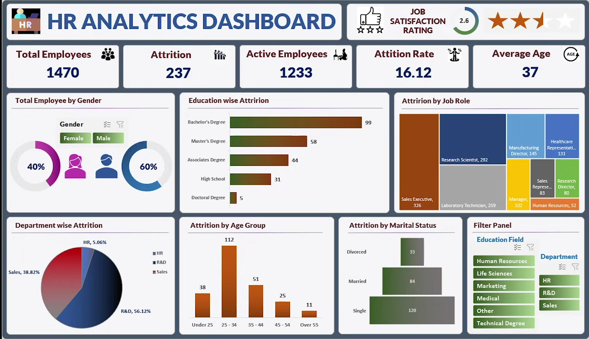

# 📊 HR Analytics Dashboard | Excel

## 📌 Project Overview
This Excel dashboard analyzes HR data to identify employee attrition patterns, demographic distribution, and workforce insights.

---

## 🎯 Objectives
- Analyze employee attrition rate
- Track total employees and active employees
- Study attrition by department, job role, and education
- Understand age group and marital status trends

---

## 📊 Key Metrics
- 👥 Total Employees: 1470
- 🚪 Attrition Count: 237
- 📉 Attrition Rate: 16.12%
- 🎂 Average Age: 37

---

## 📷 Dashboard Preview

---

## 🛠 Tools Used
- Microsoft Excel
- Pivot Tables
- Charts & Visualizations
- Data Cleaning
- Dashboard Design

---

## 🔍 Insights Generated
- R&D department shows highest attrition
- Sales Executives have highest turnover
- Age group 25–34 shows highest attrition
- Majority attrition among Bachelor's degree holders

---

## 👨‍💻 Author
Ankith I N  
Final Year BE | Data Analyst
